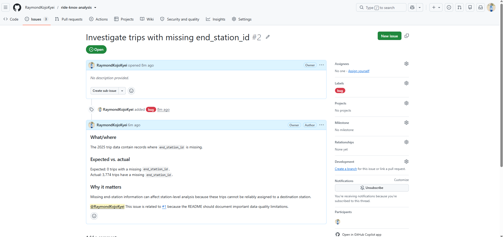
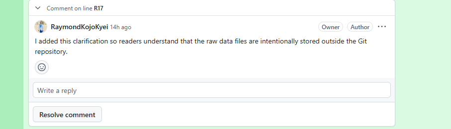
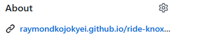
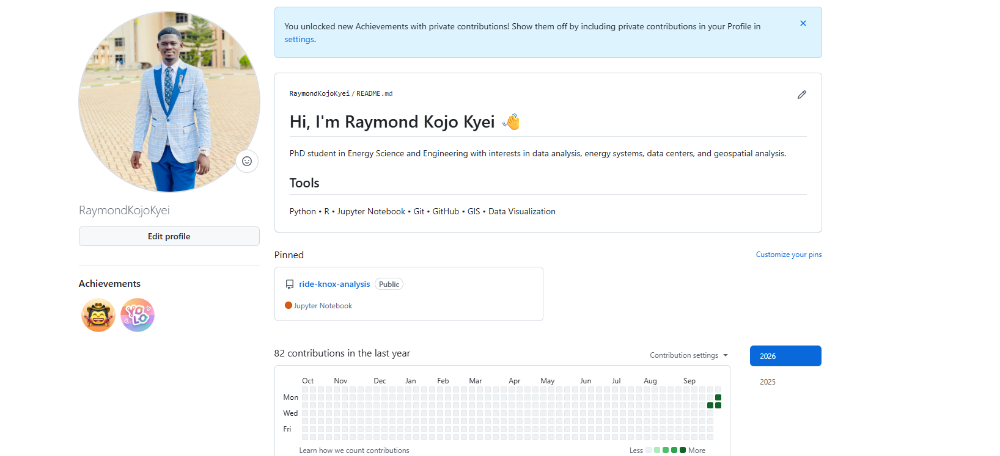

# DATA 501 — Assignment 6 Collaboration Log

**Name:** Raymond Kojo Kyei  
**NetID:** rkyei

---

## Part 0 — Setup & Starting State

### TODO 0a — Starting state

I ran:

```text
git status
```

Output:

```text
On branch main
Your branch is up to date with 'origin/main'.

nothing to commit, working tree clean
```

I also ran:

```text
git log --oneline
```

The Assignment 5 history was present, including the original split commits, `.gitignore`, recovery/revert work, and the resolved merge-conflict history. Relevant commits included:

```text
f53dff0 Add Ride Knox analysis report
0cc2ba8 Add analysis notebook and charts
b5d14b4 Add assignment worklog
04c0d6f Complete Part 1 worklog
7af5bd3 Add project ignore rules
fe55ad5 Complete Part 2 worklog
f9c21e8 Reword minimum trip duration cutoff
0bd00ba Complete Part 3 worklog
2313124 Record Part 4 staged recovery
f8c04bd Add exaggerated claim (on purpose, for Part 4)
ea4c34b Revert exaggerated claim
1584042 Complete Part4
bc2dd51 Raise minimum trip cutoff to 2 minutes
614af31 Complete Part5
70dfd64 Reword 24-hour limitation
7f47f02 Reword 24-hour limit on main
da128de Resolve 24-hour limitation conflict using main wording
0c0395e Part6
54cc7bb Part7
87d7ac5 recovery
fa37f08 Part8
56284d5 reflection
```

I confirmed that the working tree was clean and that the Assignment 5 history was intact.

### TODO 0b — Create the collaboration log

I created `COLLAB-LOG.md` as the worklog for Assignment 6 and committed it with a descriptive commit message.

Commit:

```text
Add Assignment 6 collaboration log
```

**Q0:** Module 5 put the project under version control and backed it up on GitHub, while Assignment 6 completes the collaboration and sharing workflow by adding issues, pull requests, peer review, documentation, and GitHub Pages.

---

## Part 1 — Issues: The Shared To-Do List

### TODO 1a — README issue

I created GitHub Issue #1.

Title:

```text
Add a project README
```

URL:

```text
https://github.com/RaymondKojoKyei/ride-knox-analysis/issues/1
```

Label:

```text
documentation
```

### TODO 1b — Data-quality issues

I inspected the 2025 trip data and obtained the following real counts:

```text
Missing end_station_id: 3774
Whitespace in start_station_name: 4997
Negative trip duration: 749
```

I created Issue #2.

Title:

```text
Investigate trips with missing end_station_id
```

URL:

```text
https://github.com/RaymondKojoKyei/ride-knox-analysis/issues/2
```

Label:

```text
bug
```

Full issue body:

```text
### What/where
The 2025 trip data contain records where `end_station_id` is missing.

### Expected vs. actual
Expected: 0 trips with a missing `end_station_id`.
Actual: 3,774 trips have a missing `end_station_id`.

### Why it matters
Missing end-station information can affect station-level analysis because these trips cannot be reliably assigned to a destination station.

@RaymondKojoKyei This issue is related to #1 because the README should document important data-quality limitations.
```

I created Issue #3.

Title:

```text
Investigate trips with negative duration
```

URL:

```text
https://github.com/RaymondKojoKyei/ride-knox-analysis/issues/3
```

Label:

```text
question
```

Full issue body:

```text
### What/where
The 2025 trip data contain records where `end_time` occurs before `start_time`.

### Expected vs. actual
Expected: 0 trips with negative duration.
Actual: 749 trips have negative duration.

### Why it matters
Negative trip durations are not physically meaningful and can distort calculations of trip duration and summary statistics.
```

### TODO 1c — Mention and cross-reference

In Issue #2, I mentioned:

```text
@RaymondKojoKyei
```

and referenced:

```text
#1
```

This linked the data-quality issue to the README documentation issue.

Screenshot showing the rendered mention and cross-reference:



**Q1:** Expected: 0 trips with a missing `end_station_id`. Actual: 3,774 trips have a missing `end_station_id`.

---

## Part 2 — A Pull Request, End to End

### TODO 2a — Create the branch

I created and switched to the required branch:

```text
chore/tidy-report
```

`git branch` showed:

```text
* chore/tidy-report
  main
```

### TODO 2b — Improve report.md

I made one small genuine change to `report.md` clarifying that the raw trip and station data are intentionally stored outside the Git repository and are not tracked in version control.

### TODO 2c — Commit, push, and open pull request

Commit message:

```text
Clarify raw data availability in report
```

Pull request:

```text
#5 — Clarify raw data availability in report
```

PR URL:

```text
https://github.com/RaymondKojoKyei/ride-knox-analysis/pull/5
```

PR description:

```text
This pull request adds a short clarification to report.md explaining that the raw trip and station data are stored outside the Git repository and are not included in version control.
```

### TODO 2d — Self-review

On the pull request's **Files changed** tab, I left a line-level comment explaining why the clarification was added.

The comment explained that the sentence helps readers understand that the raw data are intentionally stored outside the Git repository.

Screenshot of the self-review line comment:



### TODO 2e — Merge and update main

After merging Pull Request #5, I switched to `main` and ran `git pull`.

The log showed:

```text
1dae9a8 Merge pull request #5 from RaymondKojoKyei/chore/tidy-report
d64d600 Clarify raw data availability in report
7494561 Merge pull request #4 from RaymondKojoKyei/docs/part1-log
e63ab7f Document Part 1 issues and cross-link
eee886d Complete Part 0 collaboration log
1d74942 Add Assignment 6 collaboration log
```

**Q2:** While the pull request was open but not yet merged, `main` had not changed because the proposed change still existed only on the `chore/tidy-report` branch.

---

## Part 3 — Write the Project README

### TODO 3a — Create the README branch

I created and switched to:

```text
docs/project-readme
```

### TODO 3b — Build README.md

I created a project README containing the required sections.

The README includes:

- a project title and one-line description;
- an overview of the manager's two questions: understanding ridership decline and identifying where additional station capacity may be needed;
- schema documentation for both raw data files;
- reproducibility instructions;
- key findings;
- the station-pressure chart;
- limitations;
- and a repository structure map.

The documented schema for `trips_2025.csv` includes the trip fields used in the analysis, including:

```text
trip_id
start_time
end_time
start_station_id
start_station_name
end_station_id
rider_type
bike_type
```

The documented schema for `stations.xlsx` includes:

```text
station_id
station_name
neighborhood
latitude
longitude
docks
year_installed
```

The README clearly states that:

```text
trips_2025.csv
stations.xlsx
```

are raw data files and are not committed to the Git repository.

The README contains a **How to Run** section explaining how to install dependencies, open `analysis.ipynb`, and use **Restart & Run All**.

The key station-capacity finding states:

```text
Ride Knox station demand is uneven: busy campus stations face the greatest capacity pressure, while Bearden and Sequoyah Hills show comparatively low use.
```

The station chart is embedded with the relative path:

```text
charts/station_pressure_yoy.png
```

The README also documents limitations, including the observational nature of the analysis, the available time period, and the documented trip-duration cutoffs.

### TODO 3c — Reword report headline

On the same branch, I also reworded the bottom-line headline in `report.md`.

Commit:

```text
Add project README and update report headline
```

**Q3:** I embedded `charts/station_pressure_yoy.png` instead of the class example's monthly rider-type chart. A relative path matters because it points to the image inside the repository, so the link can continue to work for someone who clones the project or views it through GitHub/GitHub Pages instead of depending on a file path that exists only on my laptop.

---

## Part 4 — Merge the README Through a Conflict

### TODO 4a — Create conflicting changes

The `docs/project-readme` branch and `main` were deliberately changed differently on the same report headline so that the pull request would produce a merge conflict.

The `main` change was committed as:

```text
Reword report headline on main
```

### TODO 4b — Open README pull request

I opened Pull Request #7.

Title:

```text
Add project README
```

URL:

```text
https://github.com/RaymondKojoKyei/ride-knox-analysis/pull/7
```

The PR description included:

```text
Closes #1
```

GitHub displayed:

```text
This branch has conflicts that must be resolved
```

### TODO 4c — Resolve the conflict locally

After merging `main` into `docs/project-readme`, the conflicted section showed:

```text
<<<<<<< HEAD
Ride Knox station demand is uneven: busy campus stations face the greatest capacity pressure, while Bearden and Sequoyah Hills show comparatively low use.
=======
Ride Knox ridership and station demand vary across the network, with some locations showing much greater use than others.
>>>>>>> main
```

I resolved the conflict by keeping the more specific station-demand wording:

```text
Ride Knox station demand is uneven: busy campus stations face the greatest capacity pressure, while Bearden and Sequoyah Hills show comparatively low use.
```

Conflict-resolution commit:

```text
Resolve report headline conflict using specific station finding
```

### TODO 4d — Merge the README pull request

Pull Request #7 was merged into `main`.

Because the PR contained:

```text
Closes #1
```

README Issue #1 automatically closed when the PR was merged.

After switching to `main` and pulling, the log showed:

```text
029c7e7 Merge pull request #7 from RaymondKojoKyei/docs/project-readme
ec4a0ca Resolve report headline conflict using specific station finding
b7886ca Reword report headline on main
c913e30 Add project README and update report headline
77541c9 Merge pull request #6 from RaymondKojoKyei/docs/part2-log
9ec4468 Document Part 2 pull request workflow
```

**Q4:** The pull request added a visible collaboration and review layer that a bare local merge did not provide. GitHub showed the conflict status to reviewers, preserved discussion around the proposed change, and recorded the decision before the change reached `main`.

---

## Part 5 — Publish with GitHub Pages

### TODO 5a — Add the Pages configuration

I created the required branch:

```text
chore/enable-pages
```

I added `_config.yml` in the repository root with:

```yaml
theme: jekyll-theme-cayman
title: Ride Knox Bike-Share Analysis
description: Ridership trends, station demand, and capacity pressure across the Ride Knox network.
```

Commit:

```text
Add Cayman theme configuration for GitHub Pages
```

The configuration was merged into `main` through a pull request.

### TODO 5b — Enable GitHub Pages

In repository settings, I configured Pages to deploy from:

```text
Branch: main
Folder: /(root)
```

Live GitHub Pages URL:

```text
https://RaymondKojoKyei.github.io/ride-knox-analysis/
```

I confirmed that:

```text
The README renders as the GitHub Pages home page.
The embedded station-pressure chart loads correctly on the live site.
The Cayman theme is active.
```

### TODO 5c — Add Pages URL to About sidebar

I added the live GitHub Pages URL to the repository's **About → Website** field.

Screenshot:



**Q5:** The site uses the **Cayman** theme. If the embedded chart appeared as a broken image on the live site, I would first check the relative image path, exact filename, capitalization, and whether the image file was committed to the repository. I would compare the Markdown image path with the actual file path in the GitHub repository.

---

## Part 6 — Peer Review / Fork Contribution

Because I did not have a partner available, I used the fallback fork workflow.

### TODO 6a-alt — Fork and improve another repository

I worked from my fork:

```text
https://github.com/RaymondKojoKyei/Student-PerfoStudent-Performance-Analysisrmance-Analysis
```

I cloned the fork and created:

```text
docs/readme-clarification
```

I made a small genuine documentation improvement by closing an unfinished Markdown code block in the README so the **Getting Started** section would render correctly.

Commit:

```text
Close README code block
```

### TODO 6b-alt — Cross-repository pull request

I opened a cross-repository pull request back to the original repository.

PR URL:

```text
https://github.com/pachehitesh/Student-Performance-Analysis/pull/1
```

I also left a line-level review comment explaining why the README fix was needed.

Comment permalink:

```text
https://github.com/pachehitesh/Student-Performance-Analysis/pull/1/changes#r4129483828
```

**Q6:** A “Request changes” review can feel less personal than verbal criticism because it focuses on a specific line or change, gives a clear written explanation of what should be improved, and gives the author time to respond without being put on the spot.

---

## Part 7 — Portfolio Polish

### TODO 7a — Profile README

I created/updated the GitHub profile repository named exactly after my username:

```text
RaymondKojoKyei
```

Profile README URL:

```text
https://github.com/RaymondKojoKyei/RaymondKojoKyei
```

The profile README contains a short introduction and a tools line covering technologies including:

```text
Python
R
Jupyter Notebook
Git
GitHub
GIS
Data Visualization
```

### TODO 7b — Pin Ride Knox repository

I pinned:

```text
ride-knox-analysis
```

to my GitHub profile.

Screenshot:



### TODO 7c — Improve the README opening

I created:

```text
docs/readme-polish
```

and moved the project's key station-demand finding and station-pressure chart near the top of the README.

Headline:

```text
Ride Knox station demand is uneven: busy campus stations face the greatest capacity pressure, while Bearden and Sequoyah Hills show comparatively low use.
```

Chart path:

```text
charts/station_pressure_yoy.png
```

Commit:

```text
Highlight key finding in README
```

README-polish pull request:

```text
https://github.com/RaymondKojoKyei/ride-knox-analysis/pull/12
```

The PR was merged into `main`.

**Q7:** Two concrete things that make this repository more likely to be clicked are the clear key finding near the top of the README and the station-pressure chart, which communicates the main result visually. Pinning the repository on my GitHub profile also makes the project easier to discover.

---

## Part 8 — Challenge: Reproducibility Bonus

### Issue

I created Issue #14.

Title:

```text
Add requirements.txt for reproducibility.
```

### Branch and requirements file

I created:

```text
chore/add-requirements
```

I added `requirements.txt` containing:

```text
pandas
matplotlib
openpyxl
jupyter
```

I updated the README's How to Run section to use:

```text
pip install -r requirements.txt
```

Commit:

```text
Add requirements file for reproducibility
```

### Pull request

The pull request description included:

```text
Closes #14
```

Part 8 PR URL:

```text
https://github.com/RaymondKojoKyei/ride-knox-analysis/pull/15
```

I self-reviewed the diff with a line-level comment explaining that `requirements.txt` provides users with one consistent command for installing project dependencies.

The PR was merged into `main`, and Issue #14 automatically closed.

**Q8:** An earlier-module habit that `requirements.txt` protects is reproducibility: documenting and preserving what is needed to recreate the project environment instead of relying on memory or one computer's setup. It especially benefits classmates, reviewers, instructors, future collaborators, and anyone cloning the repository because they can install the required Python packages directly rather than trying to infer all dependencies from the README or notebook.

---

## Reflection + AI Disclosure

### R1

The pull request conflict was more nerve-wracking for me because I had to resolve two competing versions without losing the correct wording. Reviewing someone else's work felt more straightforward because I could focus on a specific change and explain why it should be improved.

### R2 — AI Disclosure

I used ChatGPT as a learning assistant during this assignment. It helped me understand the Git and GitHub workflow, interpret terminal output, organize the required steps, draft short issue and pull request descriptions, and troubleshoot mistakes such as branch commands, merge-conflict documentation, and Markdown formatting. I still carried out the Git commands, GitHub actions, file edits, issue creation, pull requests, reviews, merges, and final checks myself.

---

## Final Verification

I confirmed that the working tree was clean:

```text
On branch main
Your branch is up to date with 'origin/main'.

nothing to commit, working tree clean
```

I also ran:

```text
git push
```

Final output:

```text
Everything up-to-date
```

All temporary local working branches had already been merged into `main` and were safely deleted. The final local branch listing was:

```text
* main
```

The repository URL is:

```text
https://github.com/RaymondKojoKyei/ride-knox-analysis
```

The live GitHub Pages URL is:

```text
https://RaymondKojoKyei.github.io/ride-knox-analysis/
```