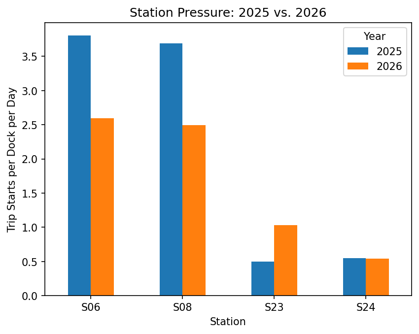

# Ride Knox Bike-Share Analysis

A reproducible analysis of Ride Knox ridership patterns, station activity, and station-capacity pressure.

## Key Finding

Ride Knox station demand is uneven: busy campus stations face the greatest capacity pressure, while Bearden and Sequoyah Hills show comparatively low use.



## Overview

This project addresses two operational questions for Ride Knox:

1. What patterns may help explain the decline in ridership?
2. Which stations appear to have the greatest need for additional capacity?

The analysis uses trip-level data together with station information to examine ridership patterns and compare station activity relative to available dock capacity.

## Data

The raw data files are intentionally excluded from this GitHub repository and remain ignored by Git. To reproduce the analysis, obtain `trips_2025.csv` and `stations.xlsx` from the course/project data source and place them in the repository root beside `analysis.ipynb`.

### `trips_2025.csv`

| Column | Description |
|---|---|
| `trip_id` | Unique identifier for each trip |
| `start_time` | Date and time the trip began |
| `end_time` | Date and time the trip ended |
| `start_station_id` | Identifier of the station where the trip began |
| `start_station_name` | Name of the station where the trip began |
| `end_station_id` | Identifier of the station where the trip ended |
| `rider_type` | Rider category associated with the trip |
| `bike_type` | Type of bicycle used |

### `stations.xlsx`

| Column | Description |
|---|---|
| `station_id` | Unique station identifier |
| `station_name` | Station name |
| `neighborhood` | Neighborhood where the station is located |
| `latitude` | Station latitude |
| `longitude` | Station longitude |
| `docks` | Number of docks available at the station |
| `year_installed` | Year the station was installed |

## How to Run

1. Install the required Python packages:

   ```bash
   pip install pandas matplotlib openpyxl jupyter

   ## Key Findings

The station-capacity analysis shows that activity is not evenly distributed across the Ride Knox network. Busy campus stations experience substantially greater trips-per-dock pressure, while stations in Bearden and Sequoyah Hills have comparatively low activity. This suggests that future capacity decisions should consider station utilization rather than simply adding docks uniformly across the system.


pip install -r requirements.txt

## Limitations

- The analysis covers only one year of trip data, so it cannot establish long-term trends by itself.
- The results are observational and should not be interpreted as proof that any single factor caused the observed ridership patterns.
- Trip-cleaning rules affect the final sample. Trips shorter than 2 minutes and trips longer than 24 hours were excluded as likely data-quality problems.
- Missing or incomplete station information may affect some station-level calculations.

## Repository Structure

```text
ride-knox-analysis/
├── analysis.ipynb
├── report.md
├── README.md
├── COLLAB-LOG.md
├── WORKLOG.md
├── .gitignore
└── charts/
    ├── nonmember_recovery.png
    └── station_pressure_yoy.png